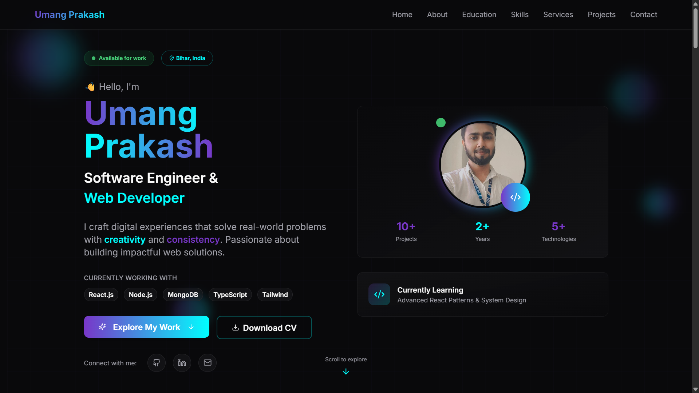

# 🌟 Umang Prakash — Personal Portfolio Website

Welcome to the source code of my **personal portfolio website** — designed to showcase my skills, projects, and background as a developer. Built with **React**, **Vite**, and **Tailwind CSS**, it’s fast, fully responsive, and optimized for the web.

🟢 **Live Site**: [umangpr.github.io/Portfolio\_2.0](https://umangpr.github.io/Portfolio_2.0/)

---

## ✨ About This Project

This website is my digital identity on the web. It highlights:

* Who I am and what I do
* Projects I've built or contributed to
* Technologies I work with
* Ways to contact or connect with me

It is built from scratch using modern web technologies and deployed via **GitHub Pages**.

---

## 📸 Preview

<!-- Add screenshot or preview image here -->


---
## ✨ Features

- **Frontend**: Built with React, TypeScript, Vite, and Tailwind CSS for fast development and a sleek design.
- **Backend**: Node.js server for handling API requests and backend logic.
- **Responsive Design**: Mobile-friendly layout and components.
- **Sections**: Hero, About, Skills, Services, Projects, Education, Contact, and more.
- **Reusable UI Components**: Includes a rich set of UI elements for rapid development.
- **PDF Resume Download**: Easily accessible resume in the public folder.

---

## 💪 Tech Stack

* **Frontend**: React + TypeScript
* **Styling**: Tailwind CSS
* **Build Tool**: Vite
* **Backend**: Node.js (for API and backend logic)
* **Deployment**: GitHub Pages

---

## 📁 Folder Structure

```bash
Portfolio_2.0/
├── backend/         # Node.js server and API
├── frontend/        # React + TypeScript client
│   ├── src/
│   │   ├── components/  # UI and section components
│   │   ├── hooks/       # Custom React hooks
│   │   ├── lib/         # Utility functions
│   │   ├── pages/       # Main pages (Index, NotFound)
│   │   ├── assets/      # Images and static assets
│   ├── public/        # Static files (Resume, robots.txt, etc.)
├── README.md
```

---

## ⚙️ Getting Started

### Prerequisites

* Node.js (v18+ recommended)
* npm or bun (for frontend)

### Installation

1. **Clone the repository:**

   ```bash
   git clone https://github.com/Umangpr/Portfolio_2.0.git
   cd Portfolio_2.0
   ```

2. **Install dependencies:**

   * Backend:

     ```bash
     cd backend
     npm install
     ```
   * Frontend:

     ```bash
     cd ../frontend
     npm install
     # or
     bun install
     ```

### Running the App

* **Start Backend:**

  ```bash
  cd backend
  npm start
  ```
* **Start Frontend:**

  ```bash
  cd frontend
  npm run dev
  # or
  bun run dev
  ```

---

## 🧠 SEO Tips Used

* Proper use of `<title>`, `<meta name="description">`, and `<h1>` tags
* Optimized performance using Vite
* Social preview support with Open Graph tags
* Clean and semantic HTML

---

## 🛠️ Customization

* Update your information in the relevant section components in `frontend/src/components/`
* Replace `public/Resume.pdf` with your own resume
* Modify styles in `App.css` or Tailwind config as needed

---

## 📬 Contact

If you want to connect or collaborate, feel free to reach out:

* Portfolio: [umangpr.github.io/Portfolio\_2.0](https://umangpr.github.io/Portfolio_2.0/)
* LinkedIn: [Umang Prakash](https://www.linkedin.com/in/umang-prakash/)
* GitHub: [@Umangpr](https://github.com/Umangpr)

---

## 📜 License

This project is licensed under the [MIT License](LICENSE).

---

Made with ❤️ by Umangpr
